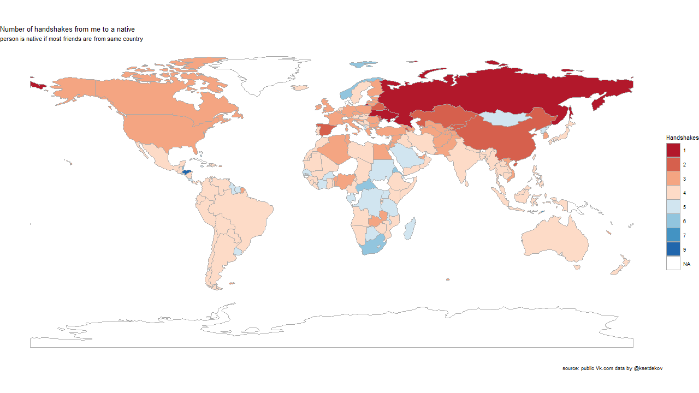
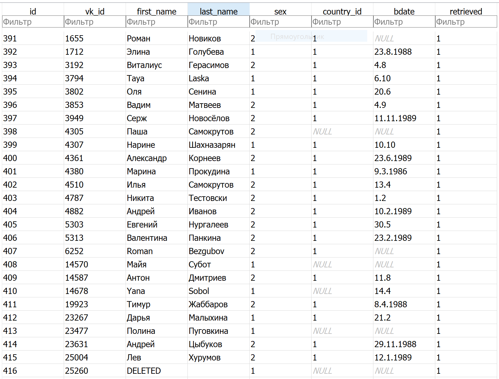

# vk_crawler
Tool to collect data for analysis about friends from open public data of social network http://vk.com/


# Results
This is a current handshake plot for me.



#### Additional comments:
* Not all countries are covered;
* I was not able to output some small French and Chinese territories on the map;
* definition of a handshake: 1 handshake = we are friends, 2 handshakes = a person is a friend of my friend, so on ...
* I was more strict with country codes - a person got a True country code, which is the highest frequency 
country code from all friends.
* Searched with breadth-first search for shortest route.

# Explaination
* This Crawler starts from one ID and pull all the friends of this person in a JSON response using the official API.
    * One must create their own hidden.py file, that contains a valid API token in a format:
    `token = 'token_string' `
* Additional fields collected with each friend list request:
    * Country
    * Birth date
    * Sex
* Name in a nominative case "nom"
 
## Additional info 
1. For it to work, ir requires an App to be created inside a Developer section of the website https://vk.com/dev and https://vk.com/apps?act=manage
2. How I received an authorisation token  https://oauth.vk.com/authorize?client_id=IDприложения&scope=friends,offline&redirect_uri=https://oauth.vk.com/blank.html&display=page&v=5.21&response_type=token
3. One of the guides I used  https://habr.com/ru/post/221251/
4. Future todo - use a guide to make plot in Python, not in R https://ramiro.org/notebook/basemap-choropleth/
5. Final results are in clean.sqlite, accessed as query:

```
SELECT name, steps FROM Countries JOIN Steps on Countries.id = Steps.id ORDER by steps
```

## Example of data collected:
**People** table



**Follows** table

from_id | to_id
------------ | -------------
1 | 2
1 | 3
1 | 4
1 | 5
1 | 6
1 | 7
